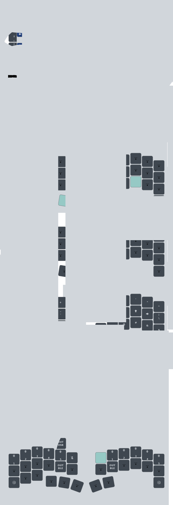

# microball zmk config
## keymap

> [!NOTE]
> The keymap was created using [Keymap Drawer](https://github.com/caksoylar/keymap-drawer) by caksoylar

## module

### PMW3610 driver implementation for ZMK
https://github.com/badjeff/zmk-pmw3610-driver

### LED indicators using an RGB LED
https://github.com/caksoylar/zmk-rgbled-widget

